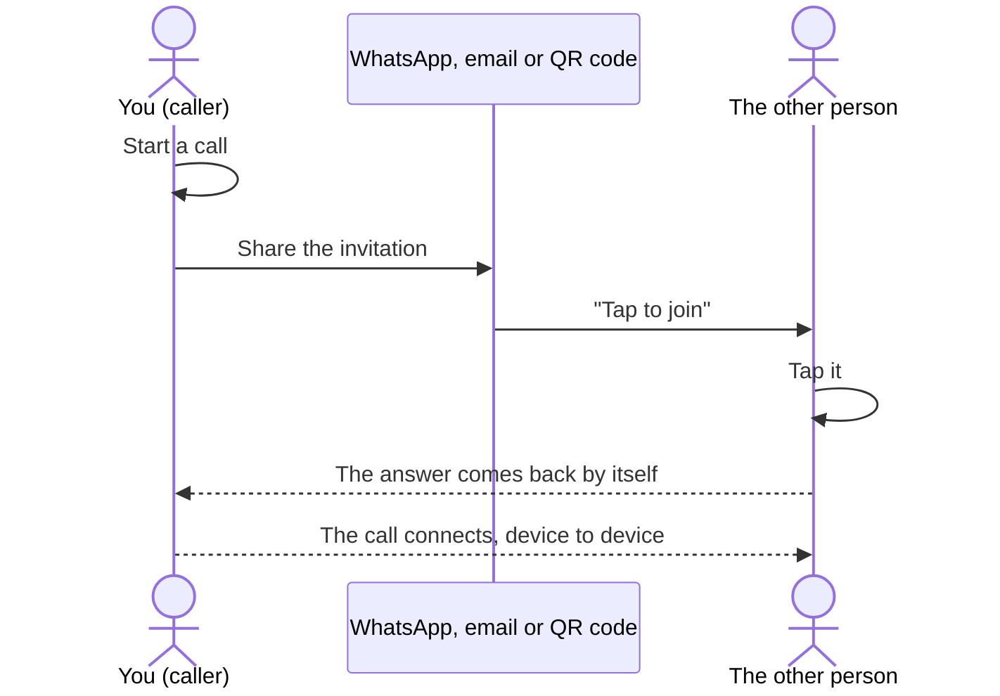
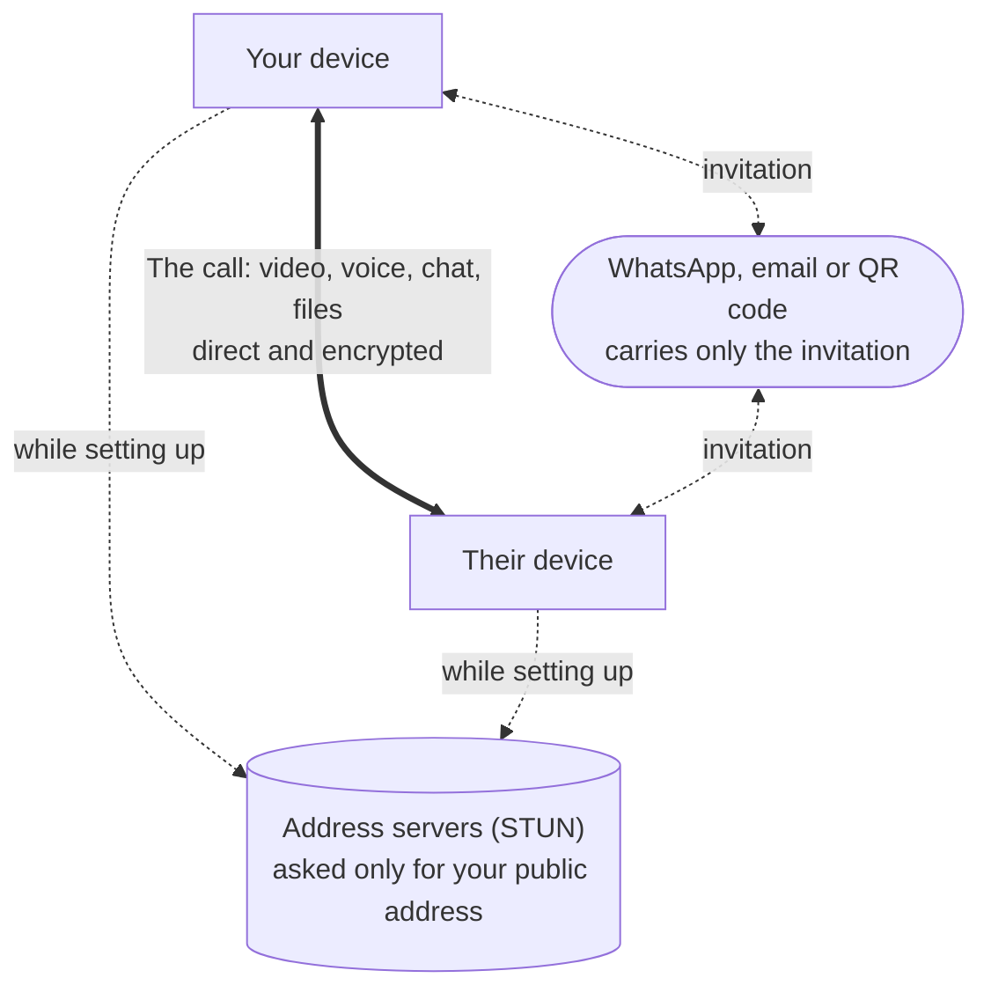

# Getting started

## Your name

The first screen asks for **your name, as the other person will see it**. It is shown to them when
they receive your invitation and during the call. Change it any time here or in **Settings**.

An iPhone or iPad does not tell apps its own name, so on the first run the field is empty and the
app asks you to type one before you can start or join a call.

## How a call is set up

There is no server to ring the other person, so the **invitation is the ring**: a call link you send
in any chat - WhatsApp, email, a QR code. They tap it, their app answers, and the answer comes back
to your device by itself. The call then runs directly between your two devices.

Sometimes the answer cannot reach your device directly - some mobile networks don't allow it. Then
the other person's app shows a **reply** and opens the share sheet with it; they send it back to you
the same way, and the call starts when you tap it.

## What travels where

The messaging app only ever carries the invitation (and, now and then, a reply). The call itself -
video, voice, chat and files - goes straight between the two devices, encrypted. The address servers
are asked how your network can be reached while a call is being set up, and are told nothing else.

With **LAN only** turned on in Settings, even the address servers are not asked, and only a device on
the same network can connect.

## Starting a call

1. Tap **Start a call**. DirectCallMe prepares your **invitation** - this takes a moment while it
   finds out how your network can be reached.
2. Send it with **Share**, **Copy**, or **Show QR code**. See
   [Sending an invitation](Sending-an-Invitation) for which to use.
3. Wait. The call starts when they open it.

Keep DirectCallMe open on the invitation screen until the call starts: the invitation belongs to that
waiting call. If they send you a reply instead, tap it, or use **Paste reply** or **Scan reply**.

### Calling someone on the same Wi-Fi

While the invitation screen is open, devices on the same network can see your call and ask to join.
You are asked **"Anna wants to join"** - accept only if you know who it is. The switch **Visible on
this Wi-Fi** turns this off for the call.

### Calling someone again

After a call, if you compared the code and tapped **Codes match**, that person appears under **Call
again** on the first screen. **Call** makes a new invitation and opens the share sheet straight
away, and the next call is recognised without comparing the code again. The **✕** forgets them.

## Joining a call

- **From a message:** tap the invitation - the file named *Tap to join … call*, or the link. The call
  starts by itself in most cases. If the app shows a reply instead, the share sheet opens with it:
  send it back the same way. It stays valid for about fifteen minutes.
- **On the same Wi-Fi:** tap **Join a call**. Calls waiting on your network are listed under **Calls
  on this Wi-Fi**; tap **Join**, and the call starts once the caller accepts.
- **In person:** tap **Join a call > Scan invitation** and scan the caller's QR code.

## During a call

- **Check the code.** Both screens show the same six characters, such as `RZA-3CP`. Read them to each
  other: if they match, you are talking to each other and nobody is in between. Tap **Codes match**
  to remember this person; next time the shield turns green by itself.
- **If the app warns** *This is not the device Anna used before*, compare the code before you trust
  the call - Anna may have a new phone, or it may not be Anna.
- **Microphone** and **camera** buttons turn yours off and on.
- **Tap the small picture** to swap it with the big one.
- **Chat** opens a message panel; files are sent from there too. A file you receive is kept only if
  you save it.
- **Low data** sends and asks for smaller video, for mobile data or a connection that keeps
  dropping.
- **The red button** hangs up. On Android the system Back button does the same.

## Settings

The gear on the first screen opens **Settings**: your name, **Low data** for every call,
**LAN only**, the STUN servers used to learn your public address, the privacy summary, and the
version to quote when reporting a problem.
