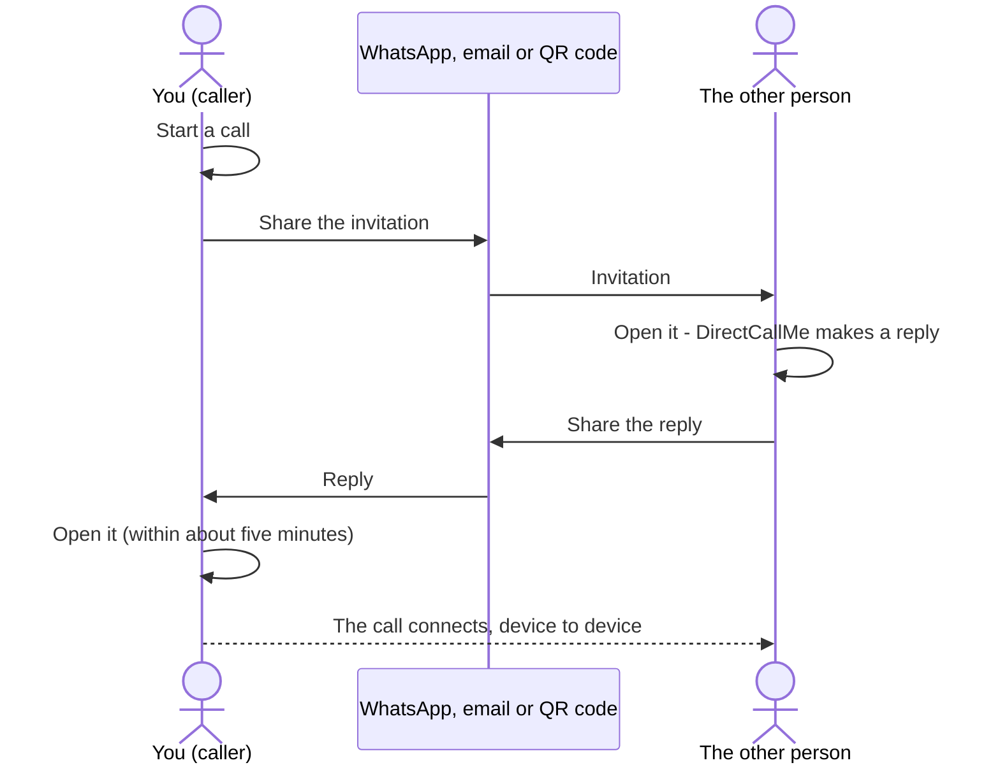
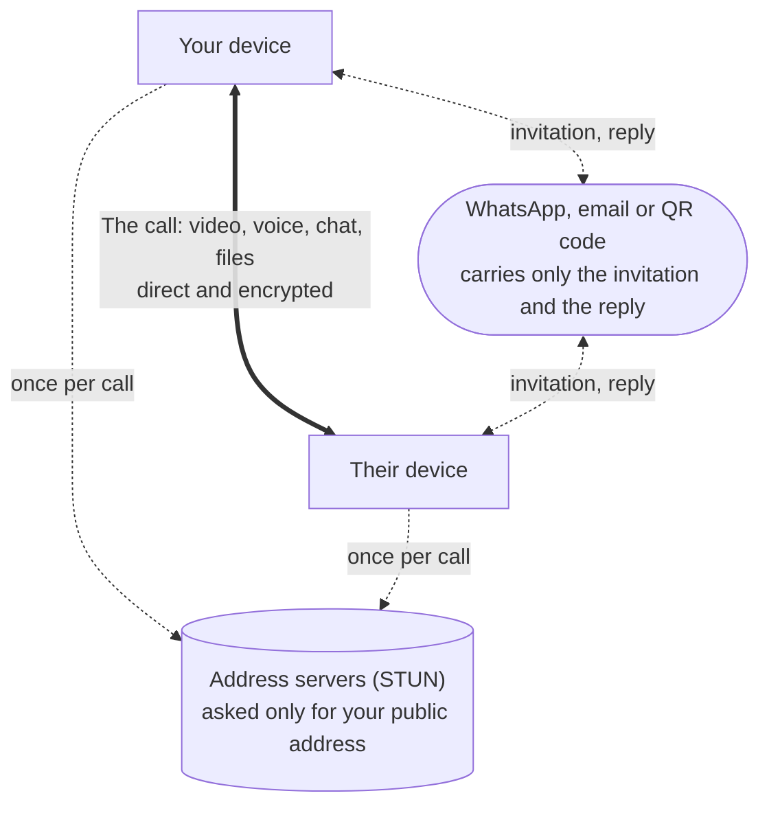

# Getting started

## Your name

The first screen asks for **your name, as the other person will see it**. It is shown to them when
they receive your invitation and during the call. Change it any time here or in **Settings**.

An iPhone or iPad does not tell apps its own name, so on the first run the field is empty and the
app asks you to type one before you can start or join a call.

## How a call is set up

One of you starts the call and sends an **invitation**; the other answers it with a **reply**. Both
travel through whatever you already use to talk - WhatsApp, email, a QR code. Once the caller opens
the reply, the call runs directly between your two devices.

## What travels where

The messaging app only ever carries the invitation and the reply. The call itself - video, voice,
chat and files - goes straight between the two devices, encrypted. The address servers are asked
once per call how your network can be reached, and are told nothing else.

With **LAN only** turned on in Settings, even the address servers are not asked, and only a device on
the same network can connect.

## Starting a call

1. Tap **Start a call**. DirectCallMe prepares your **invitation** - this takes a moment while it
   finds out how your network can be reached.
2. Send it to the other person with **Share invitation**, **Copy**, or **Show QR code**. See
   [Sending an invitation](Sending-an-Invitation) for which to use.
3. Wait for their **reply**. When it arrives, open it on this device - tap the file, or use **Paste
   reply** or **Scan reply**. The call connects.

Keep DirectCallMe open on the invitation screen until the reply comes back: the invitation belongs
to that waiting call.

## Joining a call

1. Open the invitation you received - tap the file, or tap **Join a call** and use **Paste
   invitation** or **Scan invitation**.
2. DirectCallMe makes a **reply**. Send it back to the caller the same way.
3. The call starts as soon as the caller opens your reply.

Send the reply back promptly - it is valid for about five minutes.

## During a call

- **Check the code.** Both screens show the same six characters, such as `RZA-3CP`. Read them to each
  other: if they match, you are talking to each other and nobody is in between.
- **Microphone** and **camera** buttons turn yours off and on.
- **Tap the small picture** to swap it with the big one.
- **Chat** opens a message panel; files are sent from there too. A file you receive is kept only if
  you save it.
- **Low data** sends and asks for smaller video, for mobile data or a connection that keeps
  dropping.
- **The red button** hangs up. On Android the system Back button does the same.

## Settings

The gear on the first screen opens **Settings**: your name, **Low data** for every call,
**LAN only**, the STUN servers used to learn your public address, the privacy summary, and the
version to quote when reporting a problem.
